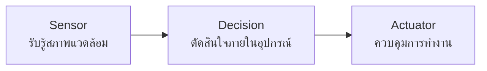

# แนะนำ Internet of Things

 **ผู้ใช้คำว่า “Internet of Things (IoT)” เป็นคนแรก**

**Kevin Ashton**
“I was talking about the supply chain being a ‘Network of Things,’ and the Internet being a ‘Network of Bits,’ and how sensor technology would merge the two together.  Then I thought of an ‘Internet of Things,’ and I thought, ‘That’ll do – or maybe even better.’ It had a ring to it. It became the title of the presentation.”

### Internet + Things 

เมื่อกล่าวถึง **Internet** เรากำลังพูดถึงโครงสร้างพื้นฐานการสื่อสารที่เชื่อมต่อเครือข่ายจำนวนมากเข้าด้วยกันจนเกิดเป็น _network of networks_ ขนาดใหญ่ระดับโลก องค์ประกอบสำคัญของอินเทอร์เน็ตเริ่มจาก **สื่อกลางในการเชื่อมต่อ** ไม่ว่าจะเป็นสายสัญญาณ คลื่นวิทยุ หรือใยแก้วนำแสง ซึ่งทำหน้าที่เป็นช่องทางให้ข้อมูลถูกส่งผ่านระหว่างอุปกรณ์และระบบต่าง ๆ

บนสื่อกลางเหล่านี้ มีการกำหนด **สถาปัตยกรรมการสื่อสาร**  (**Network architecture**) เพื่อกำหนดรูปแบบการเชื่อมต่อและการไหลของข้อมูล เช่น โครงสร้างแบบ Client–Server ที่มีศูนย์กลางควบคุม หรือโครงสร้างแบบกระจายที่อุปกรณ์สื่อสารกันโดยตรง ทั้งหมดนี้เป็นการออกแบบเพื่อให้ระบบสามารถทำงานได้อย่างมีประสิทธิภาพและรองรับการขยายตัวของเครือข่าย

เพื่อให้อุปกรณ์ที่หลากหลายสามารถสื่อสารกันได้อย่างถูกต้อง จำเป็นต้องมี **โพรโทคอล** (**Protocol**) ซึ่งเป็นชุดกติกาที่กำหนดรูปแบบการรับ–ส่งข้อมูล เช่น TCP/IP สำหรับการสื่อสารพื้นฐานบนอินเทอร์เน็ต หรือ MQTT/CoAP ที่ออกแบบมาเพื่อรองรับอุปกรณ์ขนาดเล็กในระบบ IoT โดยเฉพาะ

### Things — อุปกรณ์เฉพาะทางในบริบท IoT

คำว่า **Things** ใน Internet of Things มักถูกตีความว่าเป็น “อะไรก็ได้ที่เชื่อมต่ออินเทอร์เน็ต” แต่ในทางปฏิบัติของงานด้าน IoT คำนี้มีความหมายเฉพาะเจาะจงมากกว่า โดยมุ่งเน้นไปที่ **อุปกรณ์เฉพาะทาง** ที่มีหน้าที่จำเพาะ เช่น เซนเซอร์ แอคชูเอเตอร์ อุปกรณ์ตรวจวัด หรือเครื่องใช้ไฟฟ้าที่สามารถส่งข้อมูลหรือรับคำสั่งได้

**ข้อยกเว้น**
แม้อุปกรณ์อย่างคอมพิวเตอร์หรือสมาร์ตโฟนจะเชื่อมต่ออินเทอร์เน็ตได้เช่นกัน แต่โดยทั่วไป **จะไม่ถูกจัดเป็นส่วนหนึ่งของ IoT** เนื่องจากเป็นอุปกรณ์แบบ General-purpose ที่ออกแบบมาเพื่อการใช้งานหลากหลายรูปแบบและมีความสามารถในการประมวลผลสูง ในขณะที่ IoT มุ่งเน้นอุปกรณ์จำนวนมากที่ทำงานเฉพาะทาง ใช้พลังงานต่ำ และทำงานอัตโนมัติเป็นหลัก

กล่าวโดยสรุป **Internet คือโครงสร้างพื้นฐานการสื่อสาร ส่วน Things คืออุปกรณ์เฉพาะทางที่ใช้โครงสร้างนั้นเพื่อส่งข้อมูลและทำงานร่วมกันเป็นระบบ IoT**

### ลักษณะเฉพาะของ IoT

**1) IoT ทำหน้าที่เชื่อมโลก physical และโลก digital เข้าด้วยกัน** 

แก่นของ IoT คือการทำให้ข้อมูลจากโลกจริงถูกนำเข้าสู่ระบบดิจิทัล และทำให้คำสั่งจากโลกดิจิทัลสามารถส่งกลับไปควบคุมโลกจริงได้ การเชื่อมต่อสองโลกนี้ทำให้ระบบสามารถรับรู้สถานการณ์จริง วิเคราะห์ และตอบสนองได้โดยอัตโนมัติ

**2) IoT เชื่อมโลก physical ด้วย sensor, actuator, และ data converter** 

อุปกรณ์ในโลกจริงไม่สามารถสื่อสารกับระบบดิจิทัลได้โดยตรง จึงต้องมีองค์ประกอบที่ทำหน้าที่แปลงสัญญาณ
- **Sensor** ทำหน้าที่ตรวจวัดปรากฏการณ์ทางกายภาพ เช่น อุณหภูมิ ความชื้น แรงดัน หรือการเคลื่อนไหว
- **Data converter** เช่น ADC/DAC ทำหน้าที่แปลงสัญญาณจากรูปแบบที่อุปกรณ์วัดได้ให้กลายเป็นข้อมูลดิจิทัลที่ระบบสามารถประมวลผล
- **Actuator** ทำหน้าที่แปลงข้อมูลดิจิทัลกลับไปเป็นการกระทำในโลกจริง เช่น เปิดวาล์ว หมุนมอเตอร์ หรือสั่งงานอุปกรณ์ไฟฟ้า

องค์ประกอบเหล่านี้คือจุดเชื่อมต่อระหว่าง physical world และ digital world

**3) IoT เชื่อมหากันด้วย network รูปแบบต่าง ๆ** 

เมื่ออุปกรณ์จำนวนมากต้องสื่อสารกัน IoT จึงต้องอาศัยเครือข่ายหลายประเภทตามข้อจำกัดของงาน เช่น
- Wi‑Fi สำหรับงานที่ต้องการแบนด์วิดท์สูง
- Bluetooth / BLE สำหรับงานระยะใกล้
- Cellular (4G/5G) สำหรับงานที่ต้องการครอบคลุมพื้นที่กว้าง
- LPWAN เช่น LoRaWAN หรือ NB‑IoT สำหรับงานพลังงานต่ำและระยะไกล
- Ethernet สำหรับระบบอุตสาหกรรมที่ต้องการความเสถียรสูง

การเลือกเครือข่ายเป็นส่วนสำคัญของสถาปัตยกรรม IoT เพราะมีผลต่อความเร็ว ความเสถียร และพลังงานที่อุปกรณ์ใช้

**4) IoT เก็บข้อมูลจาก sensor ไว้ในโลก digital** 

ข้อมูลที่ได้จาก sensor จะถูกส่งเข้าสู่ระบบดิจิทัลเพื่อจัดเก็บ ประมวลผล และวิเคราะห์ อาจอยู่ในรูปแบบ
- local storage บนอุปกรณ์ edge
- cloud storage สำหรับการประมวลผลขนาดใหญ่
- data lake หรือระบบวิเคราะห์ข้อมูลแบบ real‑time

การเก็บข้อมูลในโลกดิจิทัลทำให้สามารถนำไปใช้ต่อ เช่น การตรวจสอบสถานะ การคาดการณ์ หรือการตัดสินใจอัตโนมัติ

**5) IoT นำข้อมูลจากโลก digital ไปสู่โลก physical ผ่าน actuator** 

หลังจากระบบวิเคราะห์ข้อมูลแล้ว คำสั่งที่ได้จะถูกส่งกลับไปยัง actuator เพื่อให้เกิดการกระทำในโลกจริง เช่น
- ปรับอุณหภูมิห้อง
- เปิด–ปิดไฟ
- ควบคุมเครื่องจักร
- แจ้งเตือนหรือหยุดการทำงานเมื่อพบความผิดปกติ

นี่คือวงจรสมบูรณ์ของ IoT: รับรู้ → ประมวลผล → ตอบสนอง

#### สรุป

IoT คือระบบที่ทำให้โลกจริงสามารถ “รายงานสถานะ” และ “รับคำสั่ง” จากโลกดิจิทัลได้อย่างต่อเนื่อง ผ่าน sensor, actuator, network และโครงสร้างการประมวลผลที่เชื่อมโยงกันเป็นหนึ่งเดียว

---
## ก่อนจะมี IoT: ระบบแบบ Automatic System

ก่อนที่แนวคิด Internet of Things จะเกิดขึ้น ระบบควบคุมจำนวนมากทำงานแบบ **Automatic system** ซึ่งเป็นระบบที่ “รับรู้–ตัดสินใจ–ควบคุม” อยู่ในวงจรปิดภายในตัวเอง โดยไม่ต้องเชื่อมต่อเครือข่ายหรือระบบภายนอก

ลักษณะสำคัญของระบบแบบ Automatic system คือการทำงานแบบอัตโนมัติในระดับพื้นฐาน โดยมีองค์ประกอบหลักสองส่วน ได้แก่
### **1) การรับรู้สภาพแวดล้อมด้วย Sensor**
ระบบอัตโนมัติยุคแรกเริ่มใช้เซนเซอร์เพื่อรับข้อมูลจากสภาพแวดล้อมจริง เช่น
- เซนเซอร์วัดแสง → ตรวจว่ามีแสงหรือไม่มีแสง
- เซนเซอร์วัดความสว่าง → ตรวจว่ามากหรือน้อย
- เซนเซอร์วัดอุณหภูมิ → ตรวจว่าร้อนหรือเย็น
- เซนเซอร์วัดความชื้น → ตรวจว่าชื้นหรือแห้ง

ข้อมูลจากเซนเซอร์เหล่านี้ถูกนำไปใช้ตัดสินใจภายในระบบ เช่น ถ้าแสงน้อย → เปิดไฟ, ถ้าแสงมาก → ปิดไฟ

ระบบลักษณะนี้ทำงานแบบ **local decision** คือการตัดสินใจเกิดขึ้นในอุปกรณ์เอง ไม่มีการส่งข้อมูลออกไปที่อื่น

### **2) การควบคุมระบบด้วย Actuator**

เมื่อระบบตัดสินใจแล้ว จะส่งสัญญาณไปยังอุปกรณ์ที่ทำหน้าที่ควบคุม เช่น
- **รีเลย์ (Relay)** → ตัด–ต่อวงจรไฟฟ้า
- **มอเตอร์** → หมุน เปิด–ปิด หรือปรับระดับ
- **วาล์วไฟฟ้า** → เปิด–ปิดการไหลของของเหลว
- **สวิตช์ไฟฟ้า** → เปิด–ปิดอุปกรณ์

ตัวอย่างที่พบได้ทั่วไปคือ **ระบบเปิดไฟอัตโนมัติเมื่อแสงน้อย** เซนเซอร์วัดแสงตรวจพบว่าความสว่างต่ำ → ส่งสัญญาณไปยังรีเลย์ → รีเลย์ต่อวงจรไฟ → หลอดไฟติดขึ้น

ระบบนี้ทำงานได้ดี แต่มีข้อจำกัดสำคัญคือ **ข้อมูลไม่ถูกส่งออกไปที่ไหน และไม่สามารถควบคุมจากภายนอกได้**

## 🔄 สรุปภาพรวม Automatic System

Automatic system คือระบบที่ทำงานอัตโนมัติในระดับพื้นฐาน โดยมีวงจรการทำงานดังนี้:

ระบบเหล่านี้ไม่มีการเชื่อมต่อเครือข่าย ไม่มีการส่งข้อมูลไปยังระบบอื่น และไม่มีการนำข้อมูลไปวิเคราะห์ต่อในโลกดิจิทัล

---

### ลักษณะของระบบยุคก่อน IoT (Early Digital Systems)

ในช่วงก่อนที่คำว่า **IoT** จะถูกใช้เป็นกรอบแนวคิดหลัก ระบบจำนวนมากที่เริ่ม “ก้าวเข้าสู่ความเป็นดิจิทัล” มักถูกเรียกด้วยคำที่สะท้อนการนำเทคโนโลยีสารสนเทศเข้ามาเชื่อมกับงานเดิม เช่น **E‑…**, **Digital**, **Internet**,   **Cyber**, หรือ **Microcontroller**  ซึ่งเป็นสัญญาณของการเปลี่ยนผ่านจากระบบอัตโนมัติแบบปิด ไปสู่ระบบที่เริ่มมีการเชื่อมต่อและแลกเปลี่ยนข้อมูลมากขึ้น

แม้ระบบเหล่านี้ยังไม่ใช่ IoT เต็มรูปแบบ แต่มีแนวคิดบางส่วนที่เป็นรากฐานของ IoT ในเวลาต่อมา เช่น

### **1) ระบบที่มีคำว่า E‑…**
ตัวอย่างเช่น
- **E‑Home**, **E‑Building**
- **E‑Health**, **E‑Government**
- **E‑Monitoring**

คำว่า _E-_ มักหมายถึงการนำระบบอิเล็กทรอนิกส์เข้ามาช่วยงาน เช่น การควบคุมอุปกรณ์ไฟฟ้า การตรวจวัดสภาพแวดล้อม หรือการจัดการข้อมูลผ่านระบบคอมพิวเตอร์ แต่ยังไม่ได้เชื่อมต่อเป็นเครือข่ายขนาดใหญ่แบบ IoT
### **2) ระบบที่ใช้คำว่า Digital**
เป็นระบบที่เริ่มแปลงข้อมูลจากสัญญาณอนาล็อกให้เป็นข้อมูลดิจิทัล เช่น
- ระบบควบคุมไฟฟ้าแบบดิจิทัล
- ระบบตรวจวัดแบบดิจิทัล
- ระบบควบคุมเครื่องจักรที่ใช้ไมโครคอนโทรลเลอร์

ข้อมูลถูกแปลงเป็นดิจิทัลเพื่อความแม่นยำ แต่ยังคงอยู่ภายในระบบ ไม่ได้ถูกส่งออกไปยังเครือข่ายภายนอก

### **3) ระบบที่ใช้คำว่า Internet**

เป็นยุคที่เริ่มนำอินเทอร์เน็ตเข้ามาเชื่อมต่อกับระบบควบคุม เช่น
- ระบบควบคุมผ่านเว็บ
- ระบบสั่งงานผ่านอินเทอร์เน็ต
- ระบบแจ้งเตือนผ่านอีเมลหรือเว็บเซิร์ฟเวอร์

แม้จะเริ่มมีการเชื่อมต่อ แต่ยังเป็นการเชื่อมต่อแบบจุดต่อจุด ไม่ใช่โครงสร้าง IoT ที่มีอุปกรณ์จำนวนมากสื่อสารกันเอง

### **4) ระบบที่ใช้คำว่า Cyber**

คำว่า _Cyber_ มักใช้ในงานที่เริ่มมีการผสานโลกจริงกับโลกดิจิทัล เช่น
- Cyber‑Physical Systems (CPS)
- ระบบควบคุมเครื่องจักรที่เชื่อมกับระบบคอมพิวเตอร์
- ระบบอุตสาหกรรมที่มีการตรวจวัดและควบคุมผ่านเครือข่าย

แนวคิดนี้เป็นรากฐานสำคัญของ IoT เพราะเน้นการเชื่อมโลก physical กับ digital เช่นเดียวกัน

## ภาพรวมของยุคก่อน IoT
ระบบเหล่านี้มีจุดร่วมคือ
- เริ่มใช้เซนเซอร์และอุปกรณ์ควบคุม
- เริ่มแปลงข้อมูลเป็นดิจิทัล
- เริ่มมีการเชื่อมต่อผ่านอินเทอร์เน็ตหรือระบบคอมพิวเตอร์
- แต่ยังไม่ใช่ระบบที่มีอุปกรณ์จำนวนมากเชื่อมต่อกันแบบกระจายตัว
- ยังไม่มีสถาปัตยกรรมที่รองรับการสื่อสารแบบ IoT เช่น MQTT, LPWAN, Edge–Cloud

กล่าวได้ว่า **ระบบ E‑… / Digital / Internet / Cyber คือช่วงรอยต่อที่ทำให้โลกอัตโนมัติแบบเดิมค่อย ๆ พัฒนาไปสู่ IoT ในยุคปัจจุบัน**

---
## เทคโนโลยีที่เกี่ยวข้องกับการพัฒนา IoT
